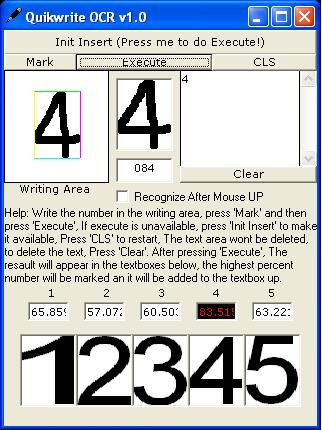



## Quikwrite OCR\!

### Description

This is a simple code for OCR (Optical Character Recognition)

Using nothing but Arrays and binary strings.

VERY SIMPLE!!!
 
### More Info
 

             |
---                |---
**Submitted On**   |2002-02-28 21:05:22
**By**             |[VBMaster\!](https://github.com/Planet-Source-Code/PSCIndex/blob/master/ByAuthor/vbmaster.md)
**Level**          |Advanced
**User Rating**    |4.9 (44 globes from 9 users)
**Compatibility**  |VB 5\.0, VB 6\.0
**Category**       |[Graphics](https://github.com/Planet-Source-Code/PSCIndex/blob/master/ByCategory/graphics__1-46.md)
**World**          |[Visual Basic](https://github.com/Planet-Source-Code/PSCIndex/blob/master/ByWorld/visual-basic.md)
**Archive File**   |[Quikwrite\_583622282002\.zip](https://github.com/Planet-Source-Code/vbmaster-quikwrite-ocr__1-32191/archive/master.zip)

